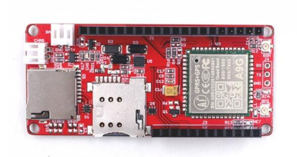
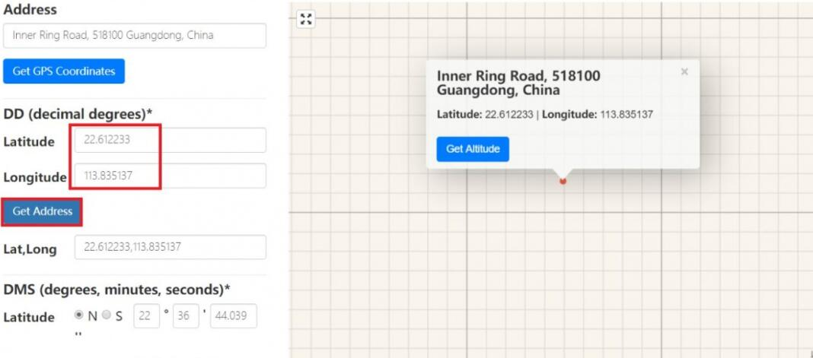
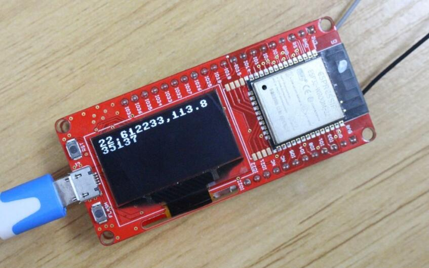
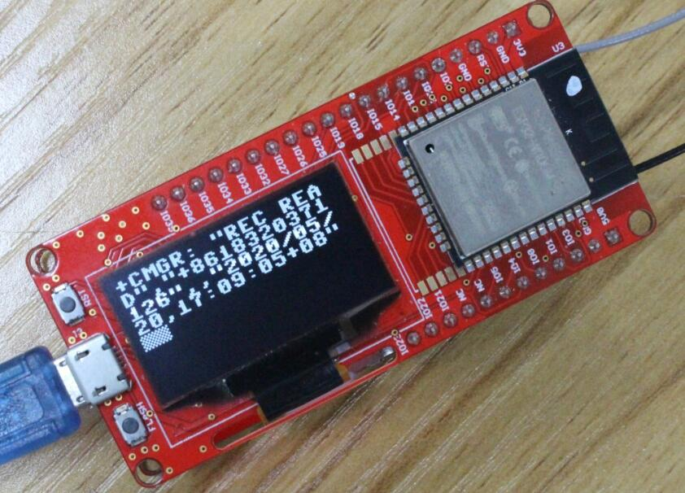
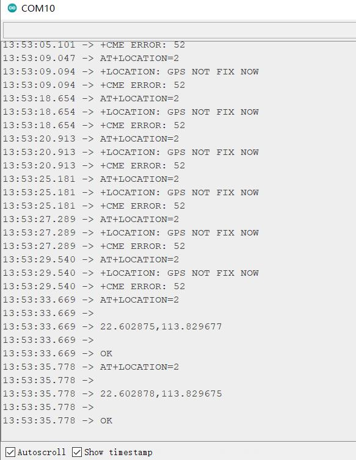

# MakePython A9G

```c++
/*
Version:		V1.1
Author:			Vincent
Create Date:	2020/7/24
Note:
	20223/1/31		V1.1: Add Arduino example for AT Command test.
*/
```

[toc]

# Introduce

MakePython A9G is an IOT for GPRS / GSM + GPS module, users can use MicroPython to program it, which is very easy, especially for non-programmers. There is also a user guide to learn how to use the board to create the first IOT project, which allows beginners to quickly learn hardware and programming skills.

With this board, you will easy to add text, SMS and data to your project. It is good for your smart home project or GPS tracker and so on.



- You can get one from: [MakePython A9G](https://www.makerfabs.com/makepython-a9g-gprs-gps-shield.html)

- Hardware and detailed instructions please visit Wiki page: [MakePython A9G Wiki](https://wiki.makerfabs.com/MaESP_A9G.html)

# Related Test

Visit the wiki for details.

- Shows the GPS location on OLED display





- Display SMS message on OLED display




# Arduino Example

## at_command.ino

The AT instruction of serial port monitor can be forwarded to the A9G module.



